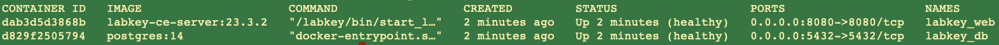

# Labkey deployment with docker
TODO
- documentation for dockerfile


This is a public repository for running LabKey Server in a docker container.
The setup also includes a possibility to connect external modules for customized webpages on the server.


## Requirements
- Docker 
- docker-compose 
- git 
- LabKey*-community.tar.gz

## Files description

- LabKeyCEServer/23.3.2/src/LabKey23.3.2-5-community.tar.gz - a LabKey Server comunity release downloaded form [official LabKey website](https://www.labkey.com/download-community-edition/current-release/) 
- enable_app.sh - utility script used for managing the application (start, stop containers)


### Create docker network 

If needed create a docker network to run the containers. The containers are running inside a dedicated network which you can find in `docker-compose.yml` file

```bash
>> docker network create nexus-pht
```


### Build the container images

1. Clone the repository to your local machine 
```bash
git clone git@github.com:ETH-NEXUS/labkey-dockerized-app.git
```

2. Download LabKey and save it to the folder `./LabKeyCEServer/22.11.0/src` 
For example: `./LabKeyCEServer/22.11.0/src/LabKey22.11.0-2-community.tar.gz`

3. Create `.env` in the current folder
```bash
POSTGRES_USER=postgres
POSTGRES_PASSWORD=<2134>
POSTGRES_DB=labkey
PG14_LK_DATA_PATH=${HOME}/labkey-docker-extern/databases/pg14_labkey<version>_db/
LABKEY_FILES_PATH=${HOME}/labkey-docker-extern/labkey_files/
LABKEY_EXTERNAL_MODULES=${HOME}/labkey-docker-extern/nexus_external_modules/
LABKEY_DEFAULT_DOMAIN=labkey-app-test.ch
```
and make adjustments according to your machine. 

4. Build the app

This deployment uses following base images:
- postgres v14
- ubuntu 22.04 LTS 

```
docker-compose -f docker-compose.yml build
```
by default docker uses `.env` file. If you named it differently please add `--env-file <labkey-var-conf>`


## Run LabKey server 

start LabKey app 
```
docker-compose -f docker-compose.yml up -d
```
in your browser go to `http://localhost:8080/` to see the app running

Running containers


and to stop the app
```
docker-compose -f docker-compose.yml down
```
